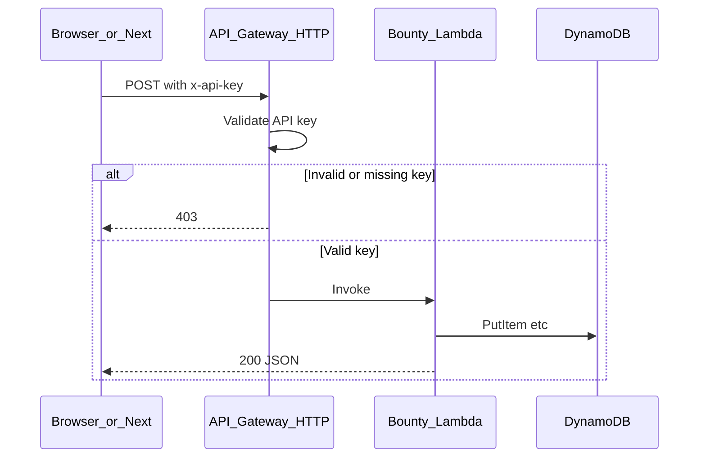
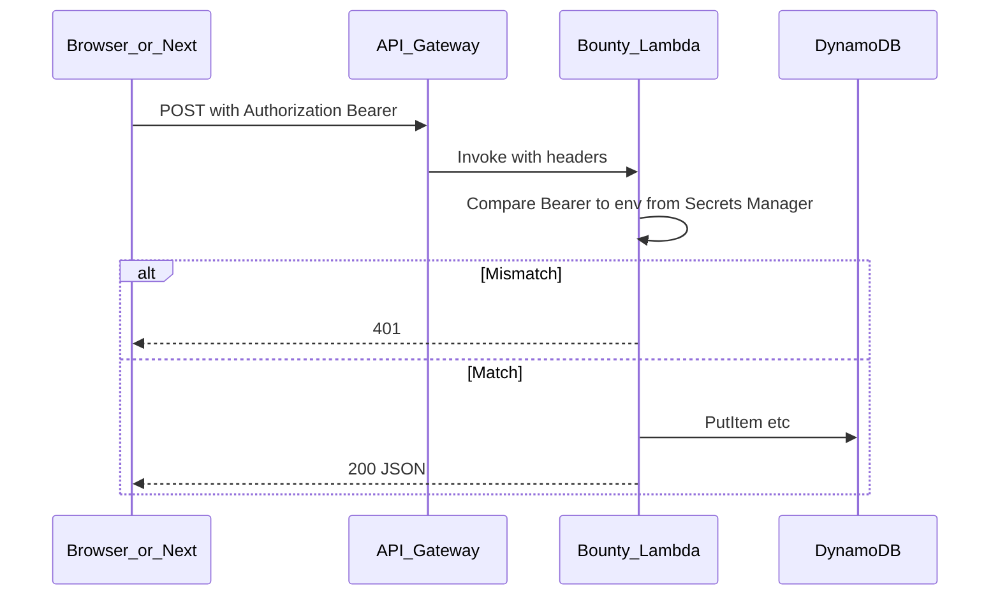

# Lambda + DynamoDB migration (updated decisions)

## How to use this plan (moving forward)

- **Canonical location (this repo):** Root file [`lambda_dynamodb_migration.plan.md`](lambda_dynamodb_migration.plan.md) — **edit this file** for all plan changes so git history stays accurate. If Cursor’s **Plans** UI still has a copy, treat **this path as source of truth** (or delete the duplicate after confirming sync) so nothing drifts.
- **Optional:** One line in [`README.md`](README.md) pointing to `./lambda_dynamodb_migration.plan.md` for discoverability.
- **Single source of truth:** This file is the **architecture + checklist**; update it when decisions change (e.g. locking **minimal write auth** vs **JWT/Clerk**).
- **Todos:** The YAML **`todos`** at the top are the **work queue**. Mark items **`completed`** in this file as you finish them (or mirror them in GitHub Issues / Jira if you prefer — keep one place authoritative).
- **New chats:** Reference **`lambda_dynamodb_migration.plan.md`** at repo root (or attach it) and say “continue the bounties / Lambda migration per plan.”
- **Per vertical:** After bounties ships, **copy the same phases** (tables → handler → API → auth → frontend) for the next feature; extend **this** doc or add new sections below — no separate index required unless the file grows unwieldy.
- **Do not delete Java** until an explicit cutover milestone (already a locked rule).

## Implementation order (where to start)

Phases **0–4** and **bounties strangler routing** are **done in repo** for the bounties slice. **Remaining** work is **auth (Layers A + B)** and **post–Java custom domain**. See YAML **`todos`** and **Next steps** below.

### Done (recent)

- **`deploy-fargopolis-api`** — `FargopolisApi` deployed; **`HttpApiUrl`** is the **`execute-api.us-east-2…`** base (until Phase 7).
- **`local-dev-workflow`** — [`fargopolis-web`](fargopolis-web/) **`VITE_API_GATEWAY_URL`**, **`.env.example`**, GitHub **`VITE_API_GATEWAY_URL`** secret for builds; **[`RequestManager`](fargopolis-web/src/helpers/RequestManager.ts)** **`getGateway` / `postGateway`** ( **`credentials: 'omit'`** toward API Gateway to satisfy CORS); CORS on **`FargopolisHttpApi`** includes **`allowCredentials`** for future credentialed use.
- **`routing`** — Bounty board calls the **Lambda API**; **`VITE_API_URL`** remains for **Java** (auth, uploads, other APIs).

### Next steps (ordered)

1. **API secret (Layer A)** — Wire **wire secret / API key** for mutations (or all routes); **SSM** or **Secrets Manager** (`todo`: **`api-secret-layer-a`**).
2. **Auth structure (Layer B)** — **Durable** user auth on **Next** for mutations (proxy + server-only secret); optional IdP (`todo`: **`auth-structure-layer-b`**; **`jwt-design`** umbrella).
3. **Custom domain cutover** — After Java no longer owns **`api.fargopolis.com`**, map that hostname to API Gateway and update env (`todo`: **`api-domain-cutover`**).
4. **Optional** — FastAPI **`dev_server`** beside the Lambda handler for faster local iteration without deploy (nice-to-have; not blocking).

Mark YAML **`todos`** **`completed`** as each step ships.

### Phase 0 — Tooling and AWS access

- **AWS:** Dev (or single non-prod) **account/region** decided; **`AWS_PROFILE`** (or SSO) works from CLI (`aws sts get-caller-identity`).
- **CDK bootstrap:** `cdk bootstrap aws://ACCOUNT/REGION` once per account/region.
- **Install:** Node.js (LTS), `aws-cdk` / `npx cdk`, Python **3.12**, `python -m venv` for handler projects.

### Phase 1 — CDK app skeleton (`local-dev-workflow` + start of `cdk-bounties-stack`)

- **Status:** **Done** in [`infrastructure/`](infrastructure/) (`FargopolisApi` + `FargopolisFrontend` stacks). Multi-env **`context`** was intentionally skipped for this app.
- Add **`infra/`** (or `cdk/`) at repo root: `cdk init app --language typescript`.
- **`context`** in `cdk.json`: e.g. `env=dev`, `region`, optional `account`; stacks **name-suffixed** by env so prod is never ambiguous.
- First **`cdk synth`** and **`cdk deploy`** with an **empty or minimal** stack to validate pipeline and profile.

### Phase 2 — DynamoDB model + tables (`ddb-model`)

- **Status:** **Done** — [`BountiesConstruct`](infrastructure/lib/constructs/bounties-construct.ts): two tables, **CategoryIndex** GSI, stable CFN logical IDs, outputs for table names.
- Define **`BountyCategories`** and **`Bounties`** tables (PKs, optional GSI) in CDK — match the **Two-table sketch** section of this plan.
- **`cdk deploy`** to dev; **`CfnOutput`** table names (or pass as env to Lambda later).
- Optional: **data backfill** script Postgres → Dynamo (one-off) when you are ready to mirror real data — not blocking “hello world.”

### Phase 3 — Python handlers + local HTTP server (`bounties-lambda` + local dev section)

- **Status:** **Lambda handler done** ([`infrastructure/lambdas/bounties/handler.py`](infrastructure/lambdas/bounties/handler.py)); **local dev** uses **`VITE_API_GATEWAY_URL`** → deployed API (or optional future **FastAPI `dev_server`** for offline iteration).
- Create **`lambdas/bounties/`** (or similar): **service layer** (Dynamo access) + thin **Lambda entry** that delegates to it.
- Add **FastAPI** (or Flask) **`dev_server.py`**: same routes as API Gateway will expose; **`AWS_PROFILE=dev`**; boto3 → **same dev tables** as Phase 2 (**shared dev DB**).
- **`VITE_API_GATEWAY_URL`** in **`fargopolis-web/.env`** (or **`.env.local`**) — point at **`execute-api…`** or localhost when using a future dev server (paths **`/api/...`** — same as Java `BaseApiController`).
- Implement **read** paths first (`GET /bounties`, `GET /bountyCategories`), then writes.

### Phase 4 — Lambda + HTTP API in AWS (`cdk-bounties-stack`)

- **Status:** **Done** — shared **`FargopolisHttpApi`** ([`fargopolis-http-api-construct.ts`](infrastructure/lib/constructs/fargopolis-http-api-construct.ts)) + **bounties routes** ([`bounties-api-routes-construct.ts`](infrastructure/lib/constructs/bounties-api-routes-construct.ts)); Python **3.12** / **arm64**; **`HttpApiUrl`** output; stack **deployed** (todo **`deploy-fargopolis-api`** complete).
- **CDK:** `lambda.Function` (Python 3.12), **IAM** `dynamodb:GetItem`/`Query`/`Scan`/`PutItem`/… on the two tables; env vars = table names.
- **API Gateway HTTP API:** routes → Lambda integrations; **path design** mirrors Java paths under **`/api`** (via `BaseApiController` + `/api`).
- **`cdk deploy`**; point **fargopolis-web** at **`HttpApiUrl`** when verifying **deployed** behavior.

### Phase 5 — Auth (`jwt-design` + `api-secret-layer-a` + `auth-structure-layer-b`)

- **Status:** **Not started** — implement in order: **Layer A** (wire secret) then **Layer B** (Next-side identity). See **Next steps** above.
- **Lock** **Layer A + B:** **(A)** API key/wire secret on API Gateway (or Lambda); **(B)** **user authentication** on the Next mutation path for the **post-Java** world (see **Layer B** — **Clerk/Cognito**, **custom JWT after your login**, or **Next admin session**). **Java session** only as a **temporary** bridge while Spring still runs login.
- **CDK:** **API keys**, **JWT authorizer** (if browser forwards IdP token to Gateway), or **Lambda authorizer**; secrets from **Secrets Manager** / SSM.
- **Client:** Bounty **mutations** call the **same-origin proxy** with **`credentials: 'include'`** so session cookies reach the Route Handler; do not expose the wire secret via **`NEXT_PUBLIC_`**.
- Mark **`api-secret-layer-a`**, **`auth-structure-layer-b`**, and umbrella **`jwt-design`** **completed** when production-intent behavior matches your threat model.

### Phase 6 — Strangler cutover (`routing`)

- **Status:** **Bounties done** — [`fargopolis-web`](fargopolis-web/) uses **`VITE_API_GATEWAY_URL`** + **`RequestManager.getGateway` / `postGateway`** for bounty routes; **`VITE_API_URL`** (Java) for everything else.
- Production builds: set **`VITE_API_GATEWAY_URL`** in **GitHub Actions** secrets to match **`HttpApiUrl`**.
- **Java stays** in repo; parity / soak as needed; **do not remove** Java bounties code until explicitly decided.

### Phase 7 — Custom domain: `api.fargopolis.com` on API Gateway (`api-domain-cutover`)

- **When:** **After** the legacy Spring app no longer serves **`api.fargopolis.com`** (or you have moved Java to another hostname and freed the name). Not during the strangler—while Java holds **`api.fargopolis.com`**, the new stack uses the **`execute-api` URL** to avoid a hostname conflict.
- **CDK:** **`aws-apigatewayv2.DomainName`** + **`ApiMapping`** to the existing **`HttpApi`**; **ACM** certificate for **`api.fargopolis.com`** (or **`*.api.fargopolis.com`**) in the **same region** as the API.
- **DNS:** **Route 53** (or your DNS host) **alias** to the API Gateway custom domain target.
- **App:** Update **`fargopolis-web`** and **GitHub Actions** env from the long **`execute-api`** base URL to **`https://api.fargopolis.com`**; paths stay **`/api/...`**.

### After bounties

- Optional **`go-handler-later`**; next **vertical** repeats Phases 2–6 (tables, handler, API, auth touchpoints, frontend env).
- **`files-auth`** when you tackle uploads (S3, etc.).

## Locked-in decisions

| Decision           | Choice           | Notes                                                                                                                                                                                                                                |
| ------------------ | ---------------- | ------------------------------------------------------------------------------------------------------------------------------------------------------------------------------------------------------------------------------------ |
| **Auth**           | **Two layers** | **(A)** **API key / shared secret** at **API Gateway**. **(B)** **Real user authentication** on **Next** for mutations — **end state does not rely on Java session** (that goes away with the Java app). Choose **IdP (Clerk/Cognito)**, **custom JWT** from a **Next/ Lambda login** you own, or **Next session** after password; use **Java session in the proxy only briefly** if needed during the strangler. Layer A = wire + scripts; Layer B = humans. **GET** public or gated. |
| **First vertical** | **Bounties**     | Smallest relational surface: two Postgres tables, no `rel_*` join tables. Good proving ground for Lambda + Dynamo modeling.                                                                                                          |
| **DynamoDB (bounties)** | **Two tables** | **`BountyCategories`** and **`Bounties`** as separate DynamoDB tables — mirrors Postgres, simple keys, clear IAM/backup per entity. Link: store `categoryId` on each bounty; resolve category with `GetItem` on the categories table (or denormalize category name on bounty for fewer reads). |
| **IaC** | **AWS CDK (TypeScript)** | New AWS resources for this vertical are defined in **CDK** (`aws-cdk-lib`, constructs in TS), not one-off console setup — versioned, reviewable, repeatable per environment (`cdk deploy`). |
| **Lambda handlers** | **Python first; Go later (optional)** | **Bounties:** Python (**not** Node — still avoids TS in handlers). **Later:** optional **Go** function or vertical for binaries/cold-starts practice. **CDK** remains TypeScript. |
| **Java during migration** | **Do not delete** | Keep **`java-recipes`** and all Spring/JDBC code **intact** while the strangler runs. Route traffic away from Java per vertical only after the new path is proven; **removal** of Java is an explicit **end-of-migration** (or never) decision — not part of each slice. |

## AWS CDK (TypeScript) for new entities

- **Scope:** Provision **DynamoDB** tables (`BountyCategories`, `Bounties`), **Lambda** function(s) for bounty APIs, **API Gateway** HTTP API (**shared** `FargopolisHttpApi` — one API for all future verticals), **IAM** (Lambda → DynamoDB least privilege), and **lightweight auth** on **POST** routes (API key, Lambda authorizer, or JWT if you choose) — from **CDK** TypeScript stacks.
- **CDK vs handler language:** **CDK always TypeScript.** Bounties use **`lambda.Function` + `Runtime.PYTHON_3_12`** and **`Code.fromAsset`** for [`infrastructure/lambdas/bounties`](infrastructure/lambdas/bounties) (Python). A **later** Go Lambda uses **`provided.al2023`** or **custom `bootstrap`** zip from **`Code.fromAsset`** when you add that slice.
- **Outputs:** Export **API base URL** (`HttpApiUrl`) and table names via **`CfnOutput`** so **`NEXT_PUBLIC_BOUNTIES_API_URL`** (or CI) can mirror the shared API base after deploy.
- **Later verticals:** Add **new route constructs** that attach to the **same** `FargopolisHttpApi` (additional Lambdas/tables) — keeps one gateway URL and one CORS surface.

## Local development (fast iteration, low risk to production)

**Goal:** Change **Python handlers** and **infra** quickly without touching **prod** resources or customer traffic.

### This repo (Fargopolis)

| Piece | Location / command |
|-------|---------------------|
| **CDK app** | [`infrastructure/`](infrastructure/) — run **`cd infrastructure && npx cdk synth`** / **`npx cdk deploy FargopolisApi`**. |
| **API stack** | `FargopolisApi` — DynamoDB + shared HTTP API + bounties Lambda (**`HttpApiUrl`** output). |
| **Bounties handler** | [`infrastructure/lambdas/bounties/handler.py`](infrastructure/lambdas/bounties/handler.py) |
| **Frontend** | [`fargopolis-web/`](fargopolis-web/) — **`VITE_API_URL`** (Java), **`VITE_API_GATEWAY_URL`** (Lambda); bounties use **`RequestManager.getGateway` / `postGateway`** (**`/api/...`**). |
| **Optional** | FastAPI **`dev_server.py`** next to the handler for local iteration without deploy. |

### Isolate production

| Layer | Practice |
|-------|-----------|
| **AWS accounts** | **Best:** separate **dev** (and optional **staging**) account from **prod**. Deploy experiments only to dev from your laptop. |
| **CDK stages** | Single repo, **`context` / env** (e.g. `env=dev` vs `env=prod`) that drives **stack names**, **resource suffixes** (`Bounties-dev`), and **removal policies** (dev: destroy OK; prod: retain / termination protection). |
| **Credentials** | Use **`AWS_PROFILE`** (or SSO) so **prod** is never the default profile on a dev machine unless intentional. |
| **Frontend** | **`VITE_API_GATEWAY_URL`** for **local** work points at **dev API Gateway** (`execute-api…`) or a mock; optional local HTTP server later. Use **`.env`** / CI secrets per environment. |
| **Guardrails (optional)** | In CDK, **assert** `Stack.account` / tags before `prod` deploys; enable **termination protection** only on prod stacks. |

### Shared dev database (explicitly okay here)

- **One non-prod DynamoDB** (same tables) used by both **deployed dev Lambda** and **your laptop** is **productive**: no drift between “what local sees” and “what dev stack sees,” and boto3 on your machine talks to the **real** DynamoDB API (transactions, indexes, etc. match prod class of service).
- **Still not production:** keep this **dev/staging** account or at least **dev-named** tables — just don’t insist on a *second* copy of data for “local vs cloud dev.”
- **Caveats:** (1) **Destructive tests** (delete table, wipe items) affect anyone else using the same dev DB — coordinate or use **separate test prefixes** / disposable items. (2) **Credentials** on the laptop must have IAM to those tables only via **dev profile**. (3) If **two writers** run concurrently (local server + dev Lambda), you get normal distributed-system behavior — fine for personal dev.

### Local-only HTTP server (yes, very productive)

Run a **small FastAPI or Flask app** on `localhost` that **reuses the same Python modules** as the Lambda handler (extract **`handle(event, context)`** core into callables that take route + body + auth headers).

| Piece | Role |
|-------|------|
| **Server** | Maps HTTP routes (`GET /bounties`, …) to the same logic Lambda uses; returns JSON like API Gateway. |
| **DynamoDB** | boto3 uses **`AWS_PROFILE`** (dev) → same **dev** tables as deployed Lambdas if you choose the shared-DB approach. |
| **JWT** | **Option A:** Forward `Authorization` and use valid **dev** tokens. **Option B (local only):** env flag `ALLOW_INSECURE_LOCAL_AUTH=1` or a **fixed dev secret** — **never** enable in Lambda; document clearly. |
| **Next.js** | `.env.local`: `NEXT_PUBLIC_BOUNTIES_API_URL=http://localhost:8xxx` while iterating on handlers; switch to dev Gateway URL when testing authorizers/CORS end-to-end. |

**Why it helps:** **Sub-second** restarts, debugger breakpoints, and no **deploy** for every line change — while still hitting **real DynamoDB** (if you want). Periodically **`cdk deploy`** to dev to confirm **Lambda packaging**, **IAM**, and **API Gateway auth** match deployed behavior.

**Related:** **Mangum** (wrap FastAPI for Lambda) can keep **one** ASGI app for both local **uvicorn** and Lambda — optional pattern to avoid drift.

### Fast iteration loops (combine as you like)

1. **Local HTTP server + shared dev Dynamo** — Tightest loop for **handler + DB** logic; Next points at localhost.
2. **Deploy to dev AWS only** — After handler changes, **`cdk deploy`** (with `--profile` + dev context) updates **dev** Lambda + API. Use **CDK `watch`** or **hotswap**-style workflows where supported so **code-only** changes redeploy in **seconds** without full CloudFormation churn. Validates **API Gateway**, **authorizer/API key**, and **IAM** as deployed.
3. **Unit tests** — Factor **core logic**; **`pytest`** + **`moto`** or stubs for fast tests **without** network.
4. **DynamoDB Local (optional)** — If you later want **offline** or **destructive** experiments without touching shared dev data — optional extra; not required if shared dev DB is acceptable.
5. **SAM / RIE (optional)** — **AWS SAM CLI** `local invoke` or **Lambda RIE** in Docker when debugging “only in Lambda” packaging issues.

### What to avoid

- **No prod deploy** from ad-hoc scripts without review; treat **`cdk deploy`** to prod as a **release** step (CI + approval).
- **Do not** point local Next.js at **prod** API when testing destructive operations on bounties.

**Summary:** Prefer **dev account + non-prod profile**; **sharing one dev Dynamo between local runs and deployed dev** is fine if you accept coordination on destructive ops. Use a **local-only HTTP server** for the fastest handler iteration (Next → `localhost`); **`cdk deploy` to dev** to validate Lambda + API Gateway + **auth** periodically. Prod stays untouched until **promotion**.

## Lambda handler language (locked staged plan)

**Locked:** **Python** for the **bounties** slice (fast path, boto3, you already know it). **Go** intentionally **deferred** — introduce for a **later** vertical or an additional Lambda when CDK + Dynamo + auth patterns feel routine.

**Reference — other runtimes** (not the current slice):

| Language | Pros for learning | CDK integration notes |
|----------|-------------------|------------------------|
| **Go** | Small binaries, fast cold starts, official AWS SDK v2 | Build `GOOS=linux GOARCH=arm64` (or amd64) `bootstrap` → zip; `CommandHooks` or Makefile before deploy |
| **Python** | Fastest to ship CRUD, huge examples | `Runtime.PYTHON_3_12`, bundle deps in asset or **Lambda layer** |
| **Rust** | Performance, ownership model practice | **cargo-lambda** artifact or Docker bundling; more setup |
| **Kotlin (JVM)** | JVM without Spring; closer to Java background | **Java** runtime or **SnapStart**; fat JAR or custom runtime |

**Operational note:** Use **ARM (Graviton)** Lambdas if you standardize on **arm64** builds — slightly cheaper; match **architecture** in CDK to your zip/binary.

### Python vs Go (tradeoffs, including “most useful experience”)

| Dimension | **Python** | **Go** |
|-----------|------------|--------|
| **Time to first working bounty API** | **Faster** — you already know it; **boto3** is ubiquitous; small handlers are a few files | Slower ramp: modules, AWS SDK v2 patterns, **linux/arm64** cross-compile, `bootstrap` zip discipline |
| **What you learn that’s *new*** | Mostly **AWS Lambda + API Gateway + DynamoDB + CDK wiring**; language surface is familiar | **New:** static typing + **interfaces**, explicit error handling, **small static binaries**, goroutines if you add concurrency; culture of “simple deploy artifact” matches many **infra / platform** tools |
| **Cold start & cost at low traffic** | Heavier runtime; **mitigate** with arm64, slim deps, **Lambda SnapStart N/A for Python** in same way as Java — generally **Go wins** on tail latency | **Usually faster cold start** and smaller package than a typical Python zip with deps |
| **Packaging** | `pip` + **layer** or vendored `site-packages` in asset; watch **bundle size** | Single **binary** in zip; reproducible builds; **no** interpreter on the image |
| **Ecosystem for this stack** | Huge examples for Lambda+DynamoDB; stacks overflow | Official AWS SDK v2 for Go is excellent; slightly fewer “copy-paste tutorial” hits than Python |
| **Overlap with TypeScript CDK** | Dynamic typing + gradual typing — mental model partly similar to TS | Forces different habits (**explicit errors, no exceptions for flow**) — **broader** skill stretch |
| **“Moving forward” signal** | Great if next steps are **data, scripting, ML ops, or rapid backend iteration** | Great if next steps are **platform eng, Kubernetes-adjacent tooling, high-performance services, or shipping tiny binaries** |

**Pragmatic read:** If the main goal is **finish the migration with low risk**, **Python** is the rational pick. If the main goal is **maximize new durable skills** *beyond* “yet another dynamically typed service,” **Go** tends to pay off longer for **cloud-native / backend** work — at the cost of a steeper first slice. **You chose** the hybrid: **Python now**, **Go when ready**.

### Staged learning (locked)

1. **Now:** Bounties handlers in **Python** — learn Lambda, API Gateway (+ simple auth), DynamoDB, CDK integration with minimal language friction.
2. **Later:** Add a **Go** handler (new function or migrated route) using the same CDK app — reuse VPC-less patterns, **arm64** `bootstrap` zip, AWS SDK v2.

## Why two tables (locked)

- Matches **two source tables** (`bounty_categories`, `bounties`) and the **FK** pattern you already have.
- **List + get-by-id** for each entity type maps cleanly: partition key = stable id (or use a single partition + SK only if you intentionally want one hot partition — usually avoid for growth).
- Later verticals (e.g. heavy `rel_*`) can still use **additional** tables or a **different** single-table design where needed; the bounties slice does not commit the whole app to one table.

## Bounties vertical — scope (current Java)

`[BountyController](java-recipes/src/main/java/com/fargopolis/controllers/BountyController.java)` under `/api`:

| Method | Path                    | Permission |
| ------ | ----------------------- | ---------- |
| GET    | `/bounties`             | canRead    |
| POST   | `/createBounty`         | canWrite   |
| POST   | `/updateBounty`         | canWrite   |
| GET    | `/bountyCategories`     | canRead    |
| POST   | `/createBountyCategory` | canWrite   |

Data today: `[BountyService](java-recipes/src/main/java/com/fargopolis/services/BountyService.java)` → `bounties` (columns include `category_id`); `[BountyCategoryService](java-recipes/src/main/java/com/fargopolis/services/BountyCategoryService.java)` → `bounty_categories`. **No join tables** in this slice — only a FK from bounty → category.

## Two-table DynamoDB sketch (bounties)

**`BountyCategories` table**

- **PK:** `categoryId` (string or number — align with migrated ids).
- **Attributes:** `name`, etc., matching [`BountyCategory`](java-recipes/src/main/java/com/fargopolis/models/BountyCategory.java).
- **List all categories:** `Scan` (acceptable if the set stays small) or a **GSI**/shared partition pattern if the list grows large.

**`Bounties` table**

- **PK:** `bountyId`.
- **Attributes:** `title`, `description`, `status`, `categoryId`, `expirationDate`, etc., matching [`Bounty`](java-recipes/src/main/java/com/fargopolis/models/Bounty.java).
- **Optional GSI:** `categoryId` as GSI PK if you need **query bounties by category** without scanning.

**Later domains:** recipes/D&D/`rel_*` can introduce **more** tables or a dedicated single-table design in a **separate** migration — not required to match the bounties layout.

## JWT: issuance options and validation

### Operator-scale default (~1–3 users, writes matter most)

For **personal / tiny admin** use, **skip full IdP** unless you want the practice:

| Approach | When to use |
|----------|-------------|
| **HTTP API route + API key** (AWS built-in) | **POST** routes require key; **GET** optional open or keyed — simplest **Gateway-side** gate |
| **`Authorization: Bearer <long random secret>`** | Lambda (or **Lambda authorizer**) compares header to value from **Secrets Manager** / SSM — one secret rotated rarely; store copy in **`recipe-site` server-only env** or build-time injection for admin UI only |
| **HTTP Basic** in front of admin routes only | Acceptable behind HTTPS for **you alone**; weaker UX for programmatic clients |

**Reads:** Java today uses **`canRead`** on bounties — you can mirror that (same secret on GET) or make **GET public** if the data is non-sensitive and you only care about **tamper-proof writes**.

### How authentication & authorization work (simple setup)

**Two separate problems** — easy to confuse:

| Layer | What it blocks | What it does **not** block |
|-------|----------------|----------------------------|
| **A. API Gateway + shared key** | Random people calling **`https://…execute-api…/bounties`** **directly** without the secret | Someone using **your own Next.js site** if your **proxy** adds the key for **every** caller |
| **B. Who may trigger writes from the site** | Visitors who are **not** you | Requires **something only you have** before the proxy forwards — see below |

If you only do **Layer A** and a **server proxy** that always attaches the key, **any visitor** who can submit the bounties form (or `fetch` your `/api/.../route`) gets writes — the server happily adds the secret. **Layer B is mandatory** for “only I can write from production” unless you never expose mutation UI to logged-out users **and** your proxy refuses requests without proof of identity.

**Layer B — use a real authentication scheme for allowed writers**

Once you need “**only these humans** may trigger writes from the site,” you are doing **user authentication**, not just a shared wire secret. **Yes, it makes sense** to use a **proper scheme** for that allowlist:

| Approach | Best when |
|----------|-----------|
| **Java session (interim only)** | **While** Spring still serves `/authentication` — Next proxy validates cookie **against Java**; **plan to remove** once login moves off Java |
| **Clerk / Cognito / Auth0** | **Durable** Layer B: hosted login, MFA, JWTs for API Gateway, **no Java** |
| **Custom JWT** | **Durable** Layer B **without** IdP: your login issues tokens (NEXT or Lambda) |
| **Next-only password → session** | **Durable**, tiny crew, httpOnly cookie, **no JWT** at Gateway unless you add it later |

The **shared API key alone** does not substitute for Layer B in the browser — it is **defense in depth** (and for **automation**). You can **also** forward the user’s **IdP access token** from proxy → API Gateway (JWT authorizer) if you want **AWS** to verify identity, not only the wire secret — optional hardening.

**For purely programmatic access** (curl/scripts): **Layer A** alone can suffice — the **secret** identifies the automation **client**, not a person in the browser.

---

**Layer A — Authentication to AWS (the API key / Bearer secret):**

- The caller proves it may reach **Dynamo-backed Lambdas** by sending **either**:
  - **`x-api-key`** plus the key value (if you use API Gateway **API keys** on those routes), **or**
  - **`Authorization: Bearer`** plus a long random **shared secret** (if Lambda or a **Lambda authorizer** checks the string).
- The **key/secret is not derived from a password at request time** — you generated it once (random), stored it in **Secrets Manager** (or SSM Parameter Store, **SecureString**), and configured **Lambda env** or **authorizer** to compare incoming headers to that value (**constant-time** compare in code to reduce timing leaks).
- That secret **does not identify** which human clicked “save” — it only proves the **HTTP caller to API Gateway** knew the wire secret. **Binding to “only me” in the browser** is **Layer B** above.

**Authorization (what they may do at AWS):**

- In the **simplest** form, **authorization is binary**: **valid secret on this route → allow**; **missing/wrong → 401/403**.
- You implement **write vs read** by **where** you attach the requirement:
  - **POST** routes (create/update bounty, create category) **require** the key/secret.
  - **GET** routes either **require** the same (tighter, like today’s Java `canRead`) or **no** credential (public list) — product choice.

**Request path (API key on Gateway):**

**Request path (Bearer secret checked in Lambda):**

**Next.js and secrets (important):**

- Anything under **`NEXT_PUBLIC_`** is **visible in the browser bundle** — **do not** put the admin secret there.
- **Safer patterns:** (1) **Route Handlers** or **Server Actions** that read **`process.env.ADMIN_API_SECRET`** (server-only) and **proxy** the request to API Gateway. (2) For a **personal** site only you use, some people still send the key from the client — that **exposes** the key to anyone who can open DevTools; acceptable **only** if you accept that risk or the site is effectively private.
- **Local dev:** same header shape; secret in **`.env.local`** for **server-side** proxy only, or temporarily in a local-only admin script.

**Production site — key in env **plus** who may call the proxy:**

- The **browser** still must **not** get **`NEXT_PUBLIC_` secrets**. The flow is:
  1. Store **`BOUNTIES_ADMIN_SECRET`** (or API key) in **server-only** env on the host.
  2. **Route Handler** (`app/api/bounties-proxy/.../route.ts`):
     - **First:** Enforce **Layer B** — **IdP session**, **Next httpOnly session** after admin login, or **only during migration** a **Java session** check. If missing/invalid → **401**, **do not** call API Gateway.
     - **Then:** **`fetch(API_GATEWAY_URL + …, { headers: { key/Authorization } })`** with the env secret and forward body/method.
  3. Client components call **`/api/bounties-proxy/...`** with **`credentials: 'include'`** so cookies reach the Route Handler.
- **GET** can stay public (direct to API URL) or proxied with the same session rule if reads should be private.
- **Why both layers:** Layer A stops anonymous internet → AWS. Layer B stops anonymous internet → your **proxy** (which impersonates AWS using the secret). Without B, **public forms** = public writes.
- **Hosting:** Server env only; never **`NEXT_PUBLIC_`** for the AWS secret.
- **Weaker option:** Key in **`NEXT_PUBLIC_`** — exposes secret **and** still no identity; **avoid** for public production.

**Clerk / Cognito / custom JWT** below remain valid if you **later** need multi-user identity, SSO, or audit trails.

---

**JWT-specific:** **Issuance** is who creates and signs the JWT after the user proves identity (password, OAuth, etc.). **Validation** is API Gateway (or Lambda) verifying signature, `exp`, `iss`, `aud` before your bounty handlers run.

### Option A — Amazon Cognito User Pools (most common on AWS)

- **Issuance:** Users authenticate via **Cognito** (Hosted UI, or `InitiateAuth` from your Next app with USER_PASSWORD_AUTH / SRP). Cognito returns **ID token**, **access token**, and **refresh token** (JWTs for id/access).
- **API calls:** Send **`Authorization: Bearer <access_token>`** (or ID token depending on resource-server setup; for API Gateway JWT authorizer, configure **audience** = Cognito **app client id** and use the token type Cognito documents for that authorizer — typically **access token** for custom scopes, **ID token** for simpler setups).
- **Validation:** **HTTP API JWT authorizer** or **REST API JWT** — point **issuer** at `https://cognito-idp.<region>.amazonaws.com/<userPoolId>` and provide **audience** (app client id). No custom authorizer code if claims are enough.
- **Custom claims (e.g. `canRead` / `canWrite`):** Add via **Cognito pre token generation** Lambda trigger, or map groups to claims.
- **Pros:** Managed users, MFA, password reset, lockout, **CDK** `UserPool` + `UserPoolClient` — little crypto code.
- **Cons:** Cognito-specific behavior and limits; migrating existing password hashes from Java may need a **migration** flow or one-time password reset.

### Option B — Custom JWT from your Lambda (full control)

- **Issuance:** After your **login Lambda** validates credentials (e.g. against **DynamoDB** users migrated from Postgres, or by calling legacy Java once), **sign** a JWT.
  - **HS256:** Single **symmetric** secret in **Secrets Manager**; simple; API validates with same secret (Lambda authorizer or HTTP API JWT if you expose issuer/JWKS — HTTP API JWT authorizer prefers **asymmetric** issuers; often people use a **Lambda authorizer** for HS256).
  - **RS256 / ES256:** **Asymmetric** key in **KMS** or stored public key; publish **JWKS** URL for API Gateway JWT authorizer — better for rotation and public verification.
- **Authorization:** Put **`canRead` / `canWrite`** (or roles) in claims at sign time.
- **Pros:** Same flow as today’s mental model (your code owns login); easy to prototype.
- **Cons:** **You** own threat model, rotation, rate limiting, and secure password storage; more code than Cognito.

### Option C — External IdP (Auth0, Clerk, Okta, etc.)

- **Issuance:** User logs in with the provider; JWTs issued with their **issuer** and **audience**.
- **Validation:** API Gateway JWT authorizer with that issuer’s **JWKS** URL and your app’s **audience**.
- **Pros:** Product features (Auth0 rules, Clerk components), less AWS-specific.
- **Cons:** Cost, another vendor; still need to map identities to your **permissions** (groups/claims or lookup in Lambda).

### Option D — Hybrid during the strangler (practical)

- **Legacy:** Cookie session → Java for unmigrated routes **while** Spring still runs.
- **Target:** **Java session goes away** with the Java app — plan **durable** Layer B (**Clerk/Cognito**, **custom JWT login**, or **Next session**) **before** or **as** you decommission Java auth.
- **Overlap window:** Bounties may use **new auth** first; other pages on Java login until migrated; **avoid** assuming “Java session forever” in the plan.

### What to put in tokens

- **Standard:** `sub` (user id), `exp`, `iat`, `iss`, `aud`.
- **App:** Custom claims or groups for **read/write** to replace `[PermissionsService](java-recipes)` checks in Lambda.
- **Refresh:** Prefer **refresh token** (opaque or JWT) with short **access token** TTL; store refresh securely (httpOnly cookie or secure storage per your threat model).

### Frontend (all options)

- `[RequestManager](recipe-site/app/_helpers/RequestManager.ts)` — for bounties: add **`Authorization: Bearer <secret>`** and/or **`x-api-key`** on **mutations** (or all calls), from **env** (never commit); if you use a full IdP later, swap to **Bearer** plus the IdP **access token**. Keep **unmigrated** pages on `credentials: "include"` to Java until unified.

### Clerk vs custom JWT signing (Layer B + tokens to AWS)

First clarify whether you **need JWT at API Gateway** for the **browser** path: **Layer B** can be **only** “proxy checks **Next session** (or IdP session) → adds wire secret” with **no** JWT. **Java session** is only an **interim** variant of that pattern while Spring remains.

Choose **Clerk vs custom JWT** when you want **identity-bearing access tokens** validated at **API Gateway** (JWT authorizer) or passed to Lambda for **`sub`** / roles:

| | **Clerk** | **Custom JWT** (you sign after login) |
|--|-----------|----------------------------------------|
| **Best for** | **Next-first** admin UX, hosted screens, social/MFA, **JWKS** fits HTTP API JWT authorizer with little code | **No** Clerk/Cognito; token must reflect **Java-verified** login, **Dynamo** user id, or custom claims **you** control |
| **You implement** | Clerk config, **JWT template** / metadata, CDK authorizer **issuer + audience** | **Login path**, **RS256 + JWKS** (or HS256 + **Lambda authorizer**), **rotation**, refresh if browser holds access token |
| **Strangler** | New **Clerk** user directory for admins; may **dual-login** with Java until unified | Can mint JWT **only after** Java/session check in **one** Route Handler or Lambda — **single** story possible but **you** build it |
| **Risk/cost** | Vendor, MAU pricing (usually low for 1–3 users) | Crypto and auth **bugs** are on you; **faster** to get wrong |

**Practical recommendation for your situation (tiny allowlist, Next site, Java still in play):**

1. **During strangler only:** **Layer B = Java session** in the Next proxy **while** login still lives on Spring; **Layer A = wire secret**.
2. **Before Java auth is removed:** Move Layer B to **Clerk/Cognito**, **Next password session**, or **custom JWT login** — **do not** leave bounties tied to a dead session store.
3. **If you want JWT at API Gateway:** **Clerk** is usually **less work** than **custom RS256 + JWKS + refresh**; **custom JWT** fits **no IdP** + full control.

**Recommendation sketch (unchanged for Cognito):** All-AWS, no extra vendor → **Cognito**. **Next + product login** → **Clerk**. **Tokens tied tightly to legacy verify only** → **custom signing** or **session proxy without JWT**. Lock in **`jwt-design`** before CDK authorizers.

## Strangler routing

- `**NEXT_PUBLIC_BOUNTIES_API_URL`** (or similar) for bounties-only requests to API Gateway, **or** single host with path-based routes — either works; env split is usually fastest for a first slice.
- Java + Postgres **unchanged** for non-bounty routes until those verticals migrate.
- **Do not delete or gut Java during migration:** Treat `[java-recipes](java-recipes)` as the **source of truth** and **fallback** until each vertical is fully cut over and you deliberately choose decommissioning. Bounties may stop **receiving** frontend traffic for those paths, but **leave the code and DB paths in place** until the team agrees it is safe to remove (often after parity tests and a soak period). This avoids dead-ends if you need to **roll back** or **compare** behavior.

## Should we pivot off Java because of Lambda?

**No — Lambda does not force dropping Java.** AWS Lambda has a **Java runtime**; you *could* implement new handlers in Java and deploy JARs from CDK if you wanted one language end to end.

**What usually happens in this kind of migration:**

| Approach | Meaning |
|----------|---------|
| **Coexist (strangler)** | **New** verticals on **Lambda + Dynamo** with **CDK (TS) + handler language of choice**. **Existing** app stays on **Spring + PostgreSQL** until each domain is ported. **No big-bang rewrite.** |
| **Gradual pivot** | Over time, **more Lambdas**, **less Java**. When the **last** routes and data depend on Java + Postgres, **decommission** the Spring service and shrink or retire the RDS footprint for app data. |
| **Stay multi-runtime** | Some teams keep **a small Java Lambda** for a library-heavy edge case; most handlers in TS/Python. Uncommon for a green slice but valid. |

**Your split:** **TypeScript for CDK only**; **handlers in Python** for bounties, **Go later** if you want static binaries / different idioms. CDK stays the “glue”; Python zips (and later maybe Go `bootstrap` zips) ship as assets.

**Bottom line:** Treat **“pivot off Java”** as a **product/roadmap** goal (**retire Spring when everything is migrated**), not as a Lambda requirement. **Short term:** hybrid is expected and healthy. **Long term:** yes — if you complete the strangler, you **can** shut down Java for this API surface entirely.

## What you have today (unchanged summary)

- Spring MVC + hand-written JDBC on PostgreSQL; `rel_`* and joins appear in **other** services (recipes, D&D), not in bounties.
- Current frontend uses `credentials: "include"` for **Java** session — **bounties on Lambda** move to **durable Layer B** (not long-term Java session). **Layer A** wire secret as above.

## Summary

- **Bounties first** with **two DynamoDB tables** (categories + bounties): straightforward mapping from Postgres and clear ownership per table.
- **AWS CDK (TypeScript)** defines the new tables, Lambdas, API Gateway, and related IAM/auth wiring — extend the same app as more verticals migrate.
- **Local dev:** **Dev** profile/stack; **shared dev Dynamo** between laptop and dev Lambdas is OK; **local-only HTTP server** (e.g. FastAPI) for fastest iteration + **periodic `cdk deploy`** to validate Lambda/Gateway/**auth** — keep **prod** off the default path.
- **Auth:** **API key/wire secret** (Layer A) **plus** **user authentication** (Layer B) — **target: no Java session**; use **Clerk/Cognito**, **Next session**, or **custom JWT**; Java cookie **only** as a **short-lived** strangler bridge.
- **Java:** **Coexist** during migration; **do not delete Java** as part of incremental slices — **optional full retirement** only as an **explicit later** decision when all verticals are migrated and validated. **Bounties:** **Python** handlers; **optional later Go** slice; **CDK** stays **TypeScript**.
- **Future verticals** remain flexible: other features can add tables or adopt single-table patterns where joins/access patterns demand it.

