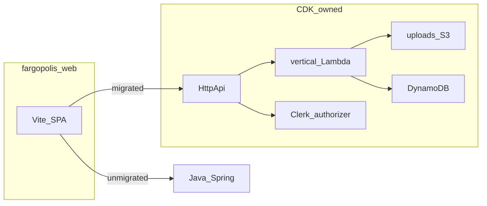

# Recipes and DnD — Lambda + Dynamo + CDK (active plan)

**Completed reference:** bounties on **FargopolisApi** (see [`infrastructure/README.md`](infrastructure/README.md), [`bounties-api-routes-construct.ts`](infrastructure/lib/constructs/bounties-api-routes-construct.ts)).

## Principles (unchanged)

- **Strangler:** same Vite app; per-vertical cutover. Use **`VITE_API_GATEWAY_URL`** + [`RequestManager`](fargopolis-web/src/helpers/RequestManager.ts) gateway helpers for migrated paths; **`VITE_API_URL`** + session cookies for legacy.
- **Auth:** same pattern as bounties — **Clerk** JWT for mutations, authorizer on shared HTTP API; public reads where product allows.
- **Do not delete Java** until you explicitly cut over and remove a route; keeps rollback and comparison possible.
- **Data migration:** each vertical that replaces Postgres data with Dynamo must include an explicit **Postgres → DynamoDB** backfill (not just “new writes go to Dynamo”). See [**Data migration**](#data-migration-postgres-to-dynamodb) below and the per-vertical checklists.

## Data migration (Postgres to DynamoDB)

Applies to **Recipes** and **DnD characters** (and was optional for bounties if you had live Postgres data; these two verticals start from real relational data).

- **When:** after **tables exist in AWS** (CDK deployed) and the **Dynamo key shape** and attributes are fixed enough to import into — you may run migrations before or in parallel with handler code, but you need a **stable item model** to avoid rework.
- **How:** one-off **script** or **Job** (Python with `boto3`, or AWS CLI + JSON, etc.) that reads from Postgres (JDBC, `psql` export, or read-replica) and `PutItem`/`BatchWriteItem` to Dynamo. Prefer **idempotent** runs in dev (delete table items + reload, or conditional writes) so you can iterate.
- **IDs:** if you move from **serial ints** in Postgres to **string ULIDs** in Dynamo, store a stable **`legacyId`** (or map file) for debugging and any straggler clients; the SPA will need the **new** primary keys in API responses after cutover.
- **Order of operations (typical):** non-prod first → row-count / checksum checks → then production migration in a **maintenance window** or low-traffic window if the dataset is small.
- **S3 / files:** data migration is about **metadata in Dynamo**; **objects in the uploads bucket** usually **stay put** (same keys). Reconcile **avatar** / `file_id` references so URLs and Dynamo attributes stay consistent.
- **Todos:** `recipes-data-migration`, `dnd-data-migration` in the YAML at the top of this file.

## Vertical 1 — Recipes (full parity)

1. **Inventory** — Map Spring controllers to Dynamo operations: [`RecipesController`](java-recipes/src/main/java/com/fargopolis/controllers/recipes/RecipesController.java), ingredients, steps ([`RecipeStepService`](java-recipes/src/main/java/com/fargopolis/services/recipes/RecipeStepService.java)), and every `fargopolis-web` call (e.g. [`RecipeDetailPage`](fargopolis-web/src/pages/RecipeDetailPage.tsx)).
2. **DynamoDB** — Design tables (or a single-table layout) for recipe metadata, line items, and ordering; align with how the UI loads nested data today.
3. **Uploads S3 in CDK (milestone)** — The legacy bucket is configured for Java in [`application.yml`](java-recipes/src/main/resources/application.yml) (`s3-bucket-name`); implementation uses [`S3Facade`](java-recipes/src/main/java/com/fargopolis/facades/S3Facade.java). **Bring this under CDK** (construct/stack): either `Bucket.fromBucketAttributes` to **import** the existing name or a **new** bucket + one-time object migration — either way, **IaC owns** bucket policy, CORS, and outputs. This is **not** the static-site bucket in [`frontend-stack.ts`](infrastructure/lib/stacks/frontend-stack.ts).
4. **IAM + presigns** — Grant Lambdas (and Java during transition) least privilege. Mirror presigned URL behavior in Python for avatar/resource URLs expected by the SPA.
5. **Data migration (Recipes)** — Backfill from Postgres: recipes, ingredients, `rel_recipe_ingredient`, `recipe_steps`, and any fields needed for parity; align S3/avatar references with existing upload keys. See [Data migration](#data-migration-postgres-to-dynamodb).
6. **Lambda + HTTP API** — New `infrastructure/lambdas/...` package and route construct; attach to the same `HttpApi` as bounties.
7. **Frontend** — Strangler: gateway for migrated paths only.
8. **Validate** — Soak and parity; then consider deleting duplicate Java paths when safe.

## Vertical 2 — DnD characters (after Recipes)

**Default scope:** match [`CharacterController`](java-recipes/src/main/java/com/fargopolis/controllers/CharacterController.java) (characters, avatar, `resourceIds`, add resource) and reuse the **same CDK-managed uploads bucket** and presign flow from Recipes. **Defer** `custom_dnd_races` / `rel_dnd_race_traits` and similar **unless** the Vite DnD UI requires them in the same release.

**Data migration (DnD):** backfill **in-scope** Postgres rows (e.g. `dnd_characters`, `rel_character_resource_file`) into Dynamo; same guidance as [Data migration](#data-migration-postgres-to-dynamodb). Custom races/traits stay out of scope until you add them to the data model and migration.

Dynamo design may be more join-heavy than bounties; decide **tables / GSIs** before implementation.

## After Recipes + DnD — platform follow-ons

These items match the “what’s next” material from the original Fargopolis serverless plan (bounties era). They are **not** blockers for shipping the two verticals; track them as separate milestones.

### Custom domain on API Gateway (stable public URL)

While **Java** still serves the legacy app on a hostname you want to reuse, the new stack should keep using the **`execute-api`…** base from **`HttpApiUrl`** to avoid a **name collision**. After the Spring API no longer owns that hostname (or you have moved Java elsewhere and freed the name):

- **CDK:** add **`aws_apigatewayv2.DomainName`** (or the v1 equivalent if you change API type) and **`ApiMapping`** onto the **existing** shared `HttpApi`; **ACM** certificate in the **same region** as the API for the hostname (e.g. `api.fargopolis.com` or a suitable subdomain).
- **DNS:** **Route 53** (or your provider) **alias** to the API Gateway custom domain target.
- **App + CI:** set **`VITE_API_GATEWAY_URL`** to **`https://api…`** (no trailing slash) in [`fargopolis-web/.env`](../fargopolis-web/.env.example) and GitHub Actions secrets so production builds use the custom domain. Paths stay **`/api/...`**.

**Todo:** `api-custom-domain` in this file’s YAML.

### Local development environment

Day-to-day handler work (same ideas as the bounties migration write-up):

- **Profile:** use a **dev** [`AWS_PROFILE`](../infrastructure/README.md#using-a-named-aws-profile) (or SSO) so you never accidentally deploy to prod from a laptop.
- **Point the SPA at dev API:** `VITE_API_GATEWAY_URL` = **`HttpApiUrl`** from a **dev** `FargopolisApi` deploy (execute-api) — validates **CORS**, **Clerk** authorizer, and **real** API Gateway behavior.
- **Shared dev data:** a single **non-prod** DynamoDB in the same account the dev stack uses is normal: local **boto3** (e.g. tests or a small local server) and **deployed dev Lambdas** can share tables if IAM allows; coordinate destructive tests.
- **Faster code-only iteration (optional):** a small **FastAPI** (or **Flask**) app on `localhost` that calls the same Python modules the Lambda entrypoint uses, mapping **`GET/POST /api/...`** the same as API Gateway; point **`VITE_API_GATEWAY_URL`** at `http://localhost:…` while iterating, then switch back to the dev execute-api URL to re-check auth and packaging. **Do not** ship “insecure local auth” flags in Lambda; keep those **local only** if you ever add them.
- **Tests without AWS:** **pytest** + **moto** (or stubs) for pure logic; **optional** [DynamoDB Local](https://docs.aws.amazon.com/amazondynamodb/latest/developerguide/DynamoDBLocal.html) if you need offline or destructive sandboxes.
- **Packaging / IAM:** still run **`cdk deploy` to dev** regularly so **Lambda zips, layers, and IAM** stay honest versus a long-running local process alone.

**Todo:** `local-dev-iteration` — capture anything you actually adopt in [README.md](../README.md) or [infrastructure/README.md](../infrastructure/README.md) when it is stable.

### Optional: new Lambdas in **Go**

After Python + CDK + Dynamo patterns are boring, you may add **one** function or a **new vertical** in **Go** for small binaries, fast cold starts, and a different language exercise — **CDK remains TypeScript**.

- **Runtime:** e.g. **`provided.al2023`** (or the current “provided” AL2 image for Go) with a single **`bootstrap`** binary in the zip; cross-compile **`GOOS=linux`**, **`GOARCH=arm64`** to match **arm64** Lambdas in this repo.
- **Wiring:** same stack — **`lambda.Function`**, `Code.fromAsset` with a pre-build step (Makefile or CDK `bundling`), attach to the same **`FargopolisHttpApi`**, same Dynamo/S3 IAM style as Python handlers.
- **When:** not required for Recipes or DnD; treat as a deliberate follow-up (see `go-lambda-optional`).

**Todo:** `go-lambda-optional`.
